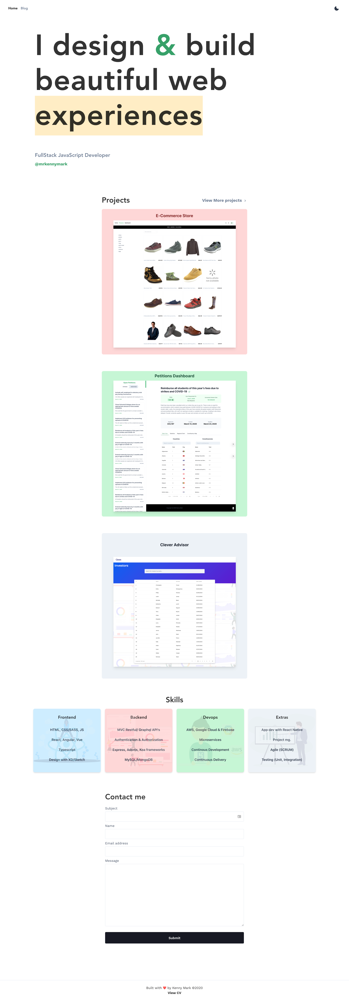
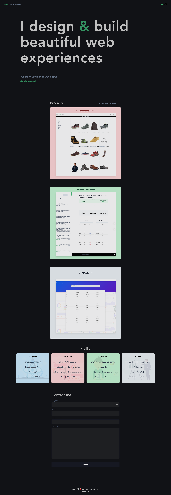
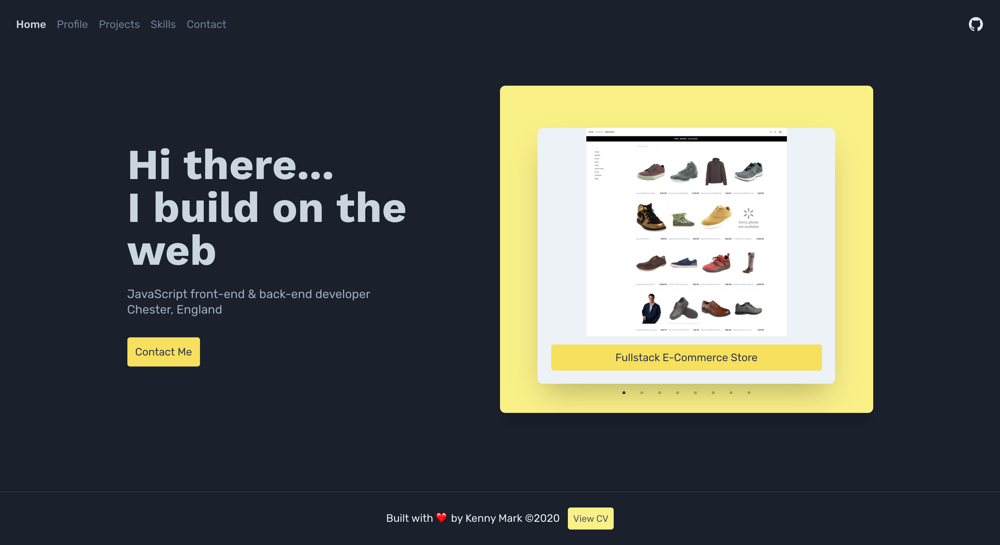
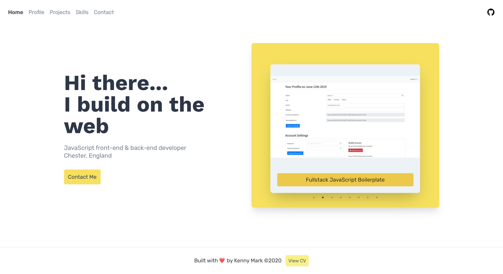
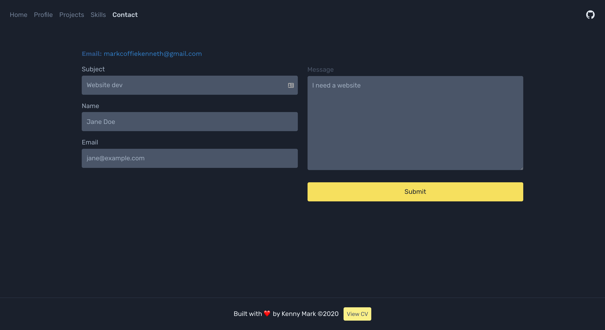
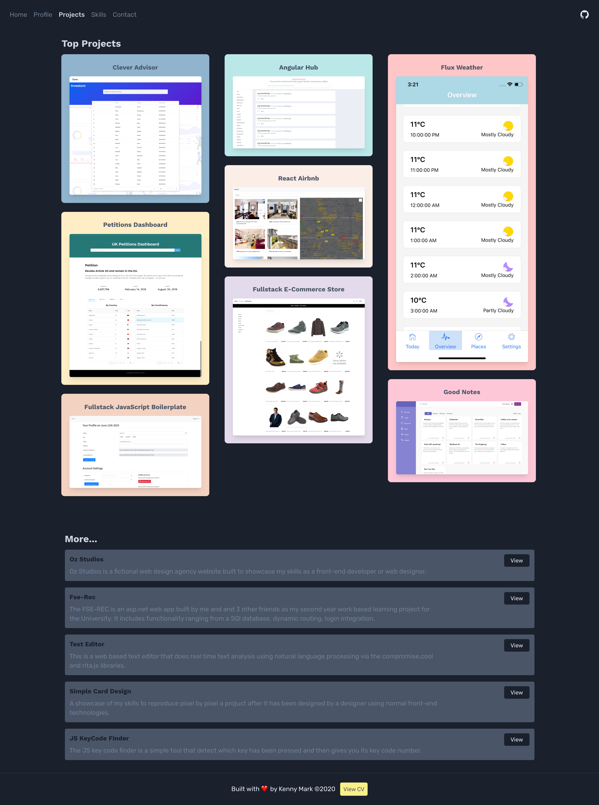
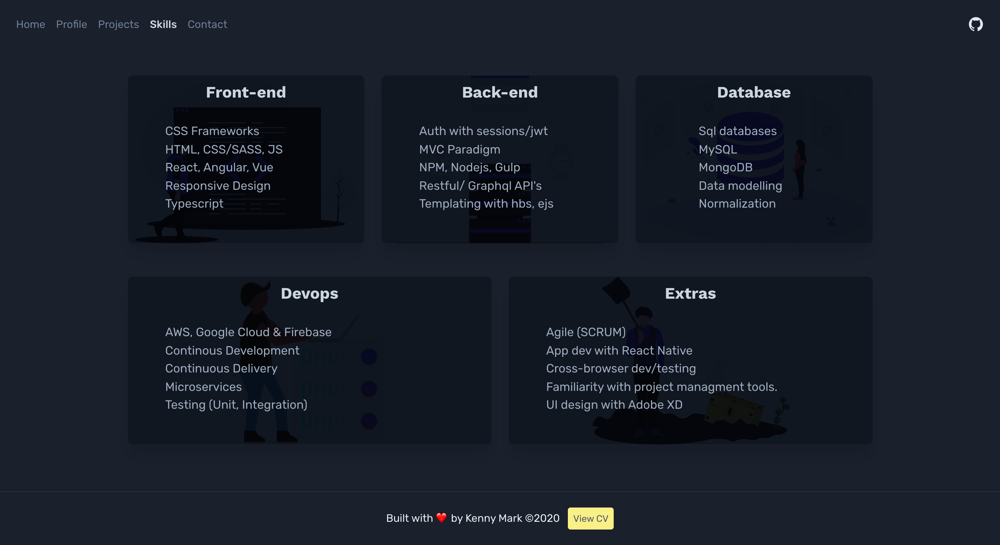
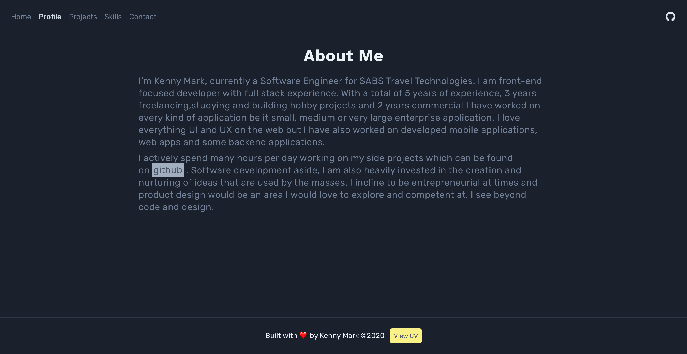

## Personal Portofolio

> This is my personal website built-with Gatsby and deployed with Netlify

## Development
`npm run dev`

## Build
`npm run build`

## Features
- Built with GatsbyJS and Netlify CMS
- SEO friendly - Option to Add meta description
- In-built contact form powered by Sendgrid and Netlify functions
- Comes with dark mode
- Google Analytics
- Dynamic project page creation at build
- Fully responsive
- Sitemap
- Contact Form
- Design with Tailwind

## Screenshots

Latest version

@mrkennymark